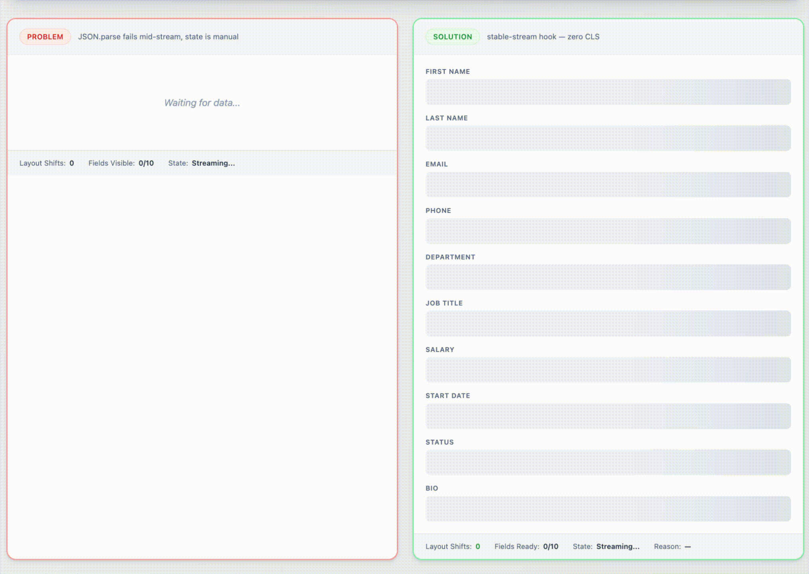

<div align="center">

# stable-stream

**Stream structured JSON from LLMs — without the chaos.**

Zero layout shift. Zero crashes. Zero hallucinations. Just stable, typed data from the first render.

[](https://www.npmjs.com/package/@vjvkrm/stable-stream-core)
[](https://www.npmjs.com/package/@vjvkrm/stable-stream-react)
[](./LICENSE)
[](https://www.typescriptlang.org/)

<br />



<br />

*Left: raw JSON streaming — empty screen, fields pop in, layout jumps.*
*Right: stable-stream — every field exists from frame one. Data fills in. Nothing moves.*

<br />

[Get Started](#installation) &nbsp;&middot;&nbsp; [Why This Exists](#the-problem) &nbsp;&middot;&nbsp; [API Reference](#api-reference) &nbsp;&middot;&nbsp; [Integrations](#works-with-every-llm-sdk)

</div>

---

## The Problem

Every team building AI-powered UIs hits the same three walls:

### 1. Your app crashes mid-stream

```tsx
// LLM is still streaming... "user" hasn't arrived yet
<h1>{data.user.name}</h1>  // TypeError: Cannot read properties of undefined
```

You end up scattering `?.` and null checks everywhere. Your TypeScript types lie to you. One missed optional chain and your users see a white screen.

### 2. Your layout jumps on every chunk

Fields pop into existence one by one. Tables grow row by row. Buttons shift position. The page looks broken even when everything is working correctly. Your CLS score tanks.

### 3. LLMs hallucinate extra fields

The model returns `{ "admin": true, "credit_card": "4111..." }` — keys you never asked for. Without protection, those leak into your state, break validation, and create security risks.

<br />

**stable-stream solves all three with one idea: generate the full UI shape *before* the first byte arrives.**

---

## How It Works

```
Your LLM stream (OpenAI, Anthropic, Vercel AI, etc.)
         |
         v
  Incomplete JSON chunks: {"name": "Jo
         |
         v
  +-------------------------------------+
  |        stable-stream/core            |
  |                                      |
  |  1. Hydrate                          |
  |     Zod schema -> full skeleton      |
  |     at T=0 (before data arrives)     |
  |                                      |
  |  2. Parse                            |
  |     Incremental O(n) JSON parser     |
  |     handles incomplete chunks        |
  |                                      |
  |  3. Merge                            |
  |     Strict merge into skeleton       |
  |     discards hallucinated keys       |
  |     preserves structural sharing     |
  +-------------------------------------+
         |
         v
  Stable, typed data — every field always defined
```

The key insight: **your Zod schema already knows the full shape.** stable-stream hydrates a complete skeleton object from it *before streaming starts*, then merges incoming data into that skeleton. Your UI never sees `undefined`. Your layout never shifts.

---

## Installation

```bash
# React (includes core automatically)
npm install @vjvkrm/stable-stream-react @vjvkrm/stable-stream-core zod

# Core only (Node.js, Vue, Svelte, vanilla — any runtime)
npm install @vjvkrm/stable-stream-core zod
```

---

## Quick Start

### React — 4 lines to stable streaming

```tsx
import { useStableStream } from '@vjvkrm/stable-stream-react';
import { z } from 'zod';

const UserSchema = z.object({
  name: z.string(),
  email: z.string(),
  bio: z.string(),
});

function UserProfile({ stream }) {
  const { data, isStreaming, isComplete } = useStableStream({
    schema: UserSchema,
    source: stream,  // AsyncIterable<string> from any LLM SDK
  });

  // data.name is ALWAYS a string — never undefined, never null
  // Every field renders from T=0 — no layout shift, no loading states per field
  return (
    <div>
      <h1>{data.name || 'Loading...'}</h1>
      <p>{data.email || '...'}</p>
      <p>{data.bio || '...'}</p>
      {isComplete && <button>Save</button>}
    </div>
  );
}
```

### Core — framework-agnostic

```typescript
import { createStableStream } from '@vjvkrm/stable-stream-core';
import { z } from 'zod';

const schema = z.object({
  title: z.string(),
  items: z.array(z.object({
    name: z.string(),
    price: z.number(),
  })),
});

for await (const { data, state, changedPaths } of createStableStream({
  schema,
  source: jsonChunks,
})) {
  console.log(data.title);      // string — always
  console.log(data.items);      // array — always (empty skeleton at T=0)
  console.log(state);           // 'streaming' | 'complete' | 'error'
  console.log(changedPaths);    // ['title', 'items[0].name'] — what just changed
}
```

---

## What Makes It Different

<table>
<tr>
<td width="50%">

**Without stable-stream**

```tsx
function Profile({ stream }) {
  const [data, setData] = useState(null);
  const [buffer, setBuffer] = useState('');

  useEffect(() => {
    // manual buffer management
    // try/catch around JSON.parse
    // prayer that fields exist
    // hope LLM doesn't hallucinate
  }, [stream]);

  return (
    <div>
      {data?.name && <h1>{data.name}</h1>}
      {data?.email && <p>{data.email}</p>}
      {/* fields pop in one by one */}
      {/* layout shifts on every field */}
    </div>
  );
}
```

</td>
<td width="50%">

**With stable-stream**

```tsx
function Profile({ stream }) {
  const { data, isComplete } = useStableStream({
    schema: ProfileSchema,
    source: stream,
  });

  return (
    <div>
      <h1>{data.name || '...'}</h1>
      <p>{data.email || '...'}</p>
      {/* all fields exist from T=0 */}
      {/* text fills in, nothing moves */}
      {isComplete && <button>Save</button>}
    </div>
  );
}
```

</td>
</tr>
</table>

| | Without | With stable-stream |
|---|---|---|
| **First render** | Empty / spinner | Full skeleton — every field visible |
| **Type safety** | `data?.user?.name` everywhere | `data.user.name` — always defined |
| **Layout shifts** | Every field arrival = shift | Zero. Nothing moves. |
| **Hallucination protection** | None — anything goes into state | Only schema keys accepted |
| **Incomplete JSON** | `JSON.parse` throws | Incremental parser handles it |
| **Lines of streaming code** | 30-50+ | 4 |

---

## Works With Every LLM SDK

stable-stream accepts any `AsyncIterable<string>` that yields JSON chunks. If your SDK can stream text, it works.

### OpenAI

```typescript
import OpenAI from 'openai';
import { useStableStream } from '@vjvkrm/stable-stream-react';

const openai = new OpenAI();

async function* streamJson(prompt: string) {
  const stream = await openai.chat.completions.create({
    model: 'gpt-4o',
    messages: [{ role: 'user', content: prompt }],
    response_format: { type: 'json_object' },
    stream: true,
  });
  for await (const chunk of stream) {
    const content = chunk.choices[0]?.delta?.content;
    if (content) yield content;
  }
}

// That's it — pass the generator to the hook
const { data } = useStableStream({ schema, source: streamJson('...') });
```

### Anthropic

```typescript
import Anthropic from '@anthropic-ai/sdk';

const anthropic = new Anthropic();

async function* streamJson(prompt: string) {
  const stream = anthropic.messages.stream({
    model: 'claude-sonnet-4-20250514',
    max_tokens: 1024,
    messages: [{ role: 'user', content: prompt }],
  });
  for await (const event of stream) {
    if (event.type === 'content_block_delta' && event.delta.type === 'text_delta') {
      yield event.delta.text;
    }
  }
}

const { data } = useStableStream({ schema, source: streamJson('...') });
```

### Vercel AI SDK

```typescript
import { streamObject } from 'ai';
import { openai } from '@ai-sdk/openai';

const { textStream } = streamObject({
  model: openai('gpt-4o'),
  schema: ProductSchema,
  prompt: 'Generate a product',
});

// textStream is already an AsyncIterable<string> — plug it in directly
const { data } = useStableStream({ schema: ProductSchema, source: textStream });
```

### Any other SDK

```typescript
// Works with anything that yields JSON text chunks
async function* myCustomStream() {
  const response = await fetch('/api/stream');
  const reader = response.body.pipeThrough(new TextDecoderStream()).getReader();
  while (true) {
    const { done, value } = await reader.read();
    if (done) break;
    yield value;
  }
}

const { data } = useStableStream({ schema, source: myCustomStream() });
```

---

## Features

### Skeleton Hydration — UI ready at T=0

Every Zod type maps to a sensible default. Your entire UI shape exists before the first byte arrives.

```typescript
import { hydrate } from '@vjvkrm/stable-stream-core';

const skeleton = hydrate(z.object({
  name: z.string(),          // → ""
  age: z.number(),           // → 0
  active: z.boolean(),       // → false
  tags: z.array(z.string()), // → []
  role: z.enum(['admin', 'user']), // → "admin" (first value)
}));
```

| Zod Type | Skeleton Value |
|----------|---------------|
| `z.string()` | `""` |
| `z.number()` | `0` |
| `z.boolean()` | `false` |
| `z.array()` | `[]` |
| `z.array().min(n)` | `[skeleton x n]` — pre-filled items |
| `z.object()` | `{ ...hydrated fields }` |
| `z.enum([...])` | First enum value |
| `z.default(val)` | Your default value |
| `z.optional()` / `z.nullable()` | Hydrated inner type |
| `z.union()` / `z.discriminatedUnion()` | `null` (resolves on first matching chunk) |

### Array Pre-fill — no table pop-in

Use `.min(n)` on array schemas to pre-render skeleton rows. Tables, lists, and grids render at full size from frame one.

```tsx
const TableSchema = z.object({
  rows: z.array(z.object({
    id: z.number(),
    name: z.string(),
    email: z.string(),
  })).min(10),  // 10 skeleton rows ready before data arrives
});

const { data } = useStableStream({ schema: TableSchema, source: stream });

// data.rows.length === 10 immediately
// Rows fill with real data as the stream progresses
// No rows popping in, no table height changes
```

### Hallucination Protection — schema is the firewall

Only keys defined in your Zod schema are accepted. Everything else is silently discarded.

```typescript
// LLM sends: { "name": "John", "admin": true, "ssn": "123-45-6789" }
// You get:   { "name": "John" }
// Discarded: ["admin", "ssn"]
```

This works recursively through nested objects, arrays, and union types. It also guards against prototype pollution attacks.

### Structural Sharing — efficient re-renders

Only changed paths get new object references. Unchanged branches keep the same reference, making React's reconciliation fast.

```typescript
const result = strictMerge(
  { user: { name: '', profile: { bio: '' } }, settings: { theme: 'dark' } },
  { user: { name: 'John' } }
);

result.data.settings === original.settings;  // true — same reference, no re-render
result.data.user !== original.user;          // true — new reference, will re-render
```

### Partial Completion Signals — know exactly what happened

```typescript
const { data, isComplete, isPartial, completionReason } = useStableStream({
  schema,
  source: stream,
});

// completionReason tells you exactly what happened:
// "complete"        → stream finished successfully, all JSON parsed
// "incomplete_json" → stream ended but JSON was truncated
// "source_error"    → the source stream threw an error
// "streaming"       → still in progress
```

### Configurable Skeleton Trimming

Pre-filled skeleton rows that never received real data can be cleaned up automatically:

```tsx
const { data } = useStableStream({
  schema: TableSchema,   // .min(10) pre-fills 10 rows
  source: stream,
  trim: true,            // Remove unfilled skeleton rows on completion
});
// If LLM only sends 6 rows, data.rows.length === 6 after stream completes
```

### 60fps Throttling

The React hook batches updates using `requestAnimationFrame` by default, capping re-renders at 60fps. Configurable:

```tsx
useStableStream({ schema, source, throttle: true });    // 60fps (default)
useStableStream({ schema, source, throttle: false });   // No limit
useStableStream({ schema, source, throttle: 200 });     // Max 1 update per 200ms
```

---

## API Reference

### React: `useStableStream(options)`

```typescript
import { useStableStream } from '@vjvkrm/stable-stream-react';

const {
  data,              // T — always complete shape, fills progressively
  isStreaming,       // boolean — true while receiving chunks
  isComplete,        // boolean — true when stream finished
  isPartial,         // boolean — true if ended incomplete or errored
  completionReason,  // 'streaming' | 'complete' | 'incomplete_json' | 'source_error' | null
  error,             // Error | null
  changedPaths,      // string[] — paths that changed in last update
  reset,             // () => void — reset to initial skeleton
} = useStableStream({
  schema,            // ZodSchema — required
  source,            // AsyncIterable<string> | string | null
  throttle,          // boolean | number (default: true)
  trim,              // boolean (default: false)
  onComplete,        // (data: T) => void
  onError,           // (error: Error) => void
});
```

### Core: `createStableStream(options)`

```typescript
import { createStableStream } from '@vjvkrm/stable-stream-core';

for await (const update of createStableStream({ schema, source })) {
  update.data;              // T — always complete shape
  update.state;             // 'streaming' | 'complete' | 'error'
  update.isPartial;         // boolean
  update.completionReason;  // StreamCompletionReason
  update.changedPaths;      // string[]
  update.error;             // Error | undefined
}
```

### Core: `consumeStableStream(options)`

Consume the full stream and return the final result:

```typescript
import { consumeStableStream } from '@vjvkrm/stable-stream-core';

const data = await consumeStableStream({ schema, source });
// data is fully typed as z.infer<typeof schema>
```

### Core: `hydrate(schema, options?)`

Generate a skeleton from a Zod schema:

```typescript
import { hydrate } from '@vjvkrm/stable-stream-core';

const skeleton = hydrate(UserSchema);
// { name: '', email: '', age: 0, active: false }

const skeleton = hydrate(RecursiveSchema, { maxDepth: 5 });
```

### Core: Low-level utilities

```typescript
import {
  createIncrementalParser,  // Incremental JSON parser
  strictMerge,              // Merge with hallucination protection
  applyParsedValue,         // Apply single value at a path
  trimSkeleton,             // Remove unfilled array items
} from '@vjvkrm/stable-stream-core';
```

---

## Input Contract

stable-stream expects the stream to contain a **top-level JSON object**:

```
Supported:     {"name": "Alice", "items": [...]}
Not supported: ["a", "b"]  (root-level arrays)
```

---

## Packages

| Package | Description | Runtime |
|---------|-------------|---------|
| [`@vjvkrm/stable-stream-core`](./packages/core) | Parser, hydration, merge engine | Node.js, Browser, Edge — anywhere |
| [`@vjvkrm/stable-stream-react`](./packages/react) | React hook with RAF throttling | React 18+ |

**Peer dependencies:** `zod ^3.22 \|\| ^4.0` &nbsp;&middot;&nbsp; **Node:** >=18 &nbsp;&middot;&nbsp; **React** (react package only): 18 or 19

---

## Performance

- **O(n) incremental parsing** — single-pass, no backtracking, no reparsing from start
- **Structural sharing** — only changed paths are cloned; React skips unchanged subtrees
- **Minimal allocations** — unchanged object references are reused
- **60fps cap** — React hook throttles via `requestAnimationFrame`
- **Tree-shakeable** — `sideEffects: false`, ESM-only

---

## Contributing

Contributions are welcome! Please open an issue first to discuss what you'd like to change.

```bash
git clone https://github.com/vjvkrm/stable-stream.git
cd stable-stream
pnpm install
pnpm build
pnpm test
```

---

## License

MIT © [Vijay Singh](https://github.com/vjvkrm)
